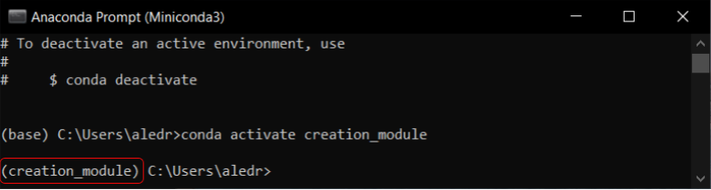

# Soundfield Room Simulation

##  **Install on Windows**

### 1) Download Miniconda 3 for your system. https://docs.conda.io/en/latest/miniconda.html

### 2) After download, open Anaconda Prompt create a new env:

$conda create -n creation_module python=3.6

* The flag "-y" is optional. It is used to confirm the command, preventing you from the need of confirmation after execution.

$conda activate creation_module

* Be aware to virtual environment's name prior to working directory path. If it is activated, it must be shown, and must be activated every time the tool is being initialized.

### 3) Install dependencies:

$conda install git

$pip install numpy scipy gmsh meshio plotly matplotlib tqdm numba cloudpickle geneticalgorithm

$pip install scikit-umfpack==0.3.1

$pip install nbformat==4.2.0

### **[Optional]**

If you want to run the **.ipynb** files using Jupyter Notebook, proceed with next steps. Otherwise you can skip it.

$ pip install notebook

$ cd path\to\simulator\working\dir 

[on my case it was C:\GitHub\soundfields_integrated_tool\soundfield_room_simulation]

$ jupyter notebook

## **Modules' responsibilities**:

### **Core**

Stores core functionalities to generate simulations, samples and datasets

* #### dataset_creation.py: functions required to generate samples/datasets

* #### dataset_splitting.py: functions required to do the train/val/test splitting
* #### entities.py: definition of class for simulations entities (Source, Room, Ambient...) to be saved as .mat

* #### utils: utility functions required on specific taks, as described by file's name
    *  #### discretization.py:
    *  #### general.py:
    *  #### plot_tools.py:
    *  #### room_properties.py:
    *  #### saving.py:

### **femder**:

Stores femder's repository. This module should be altered only to change directly how Finite Element Method work, its advanced parameters, entities...

### **Tutorial**

Notebooks containing tutorials teaching how to use this module. These notebooks can also be used to quickly generate samples or dataset without changing .py scripts

### **create_dataset.py**

Main function to provide direct creation and split of dataset. Just set the values for training parameters in the file and run it (either through the IDE or through command prompt) to start generating. The dataset is created in the path set on `config.json`.

Directly usage:
* Open Anaconda Prompt
* Change to this directory with the command *"cd path/to/directory"*
* Activate virtaul environment with command *"conda activate creation_module"*
* Set on `create_dataset.py` the parameters
* Run *"python create_dataset.py"*
### **config.json**

File containing the path for the storage module to integrate this module to the neural network one. By default they are all on the same directory, however if required they can work along even on diferent drives, just set the required path in `config.json` file in both modules.
